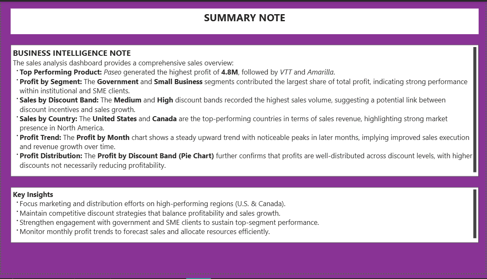
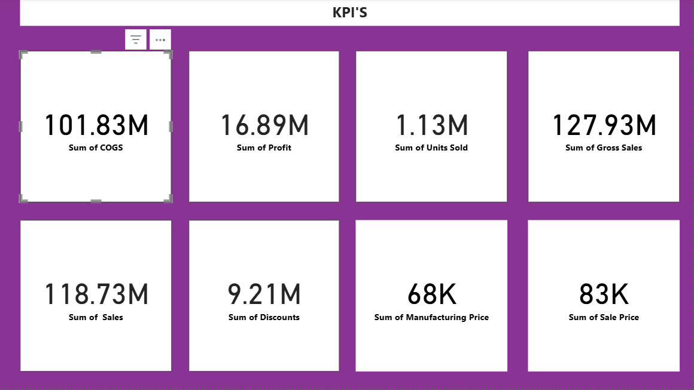
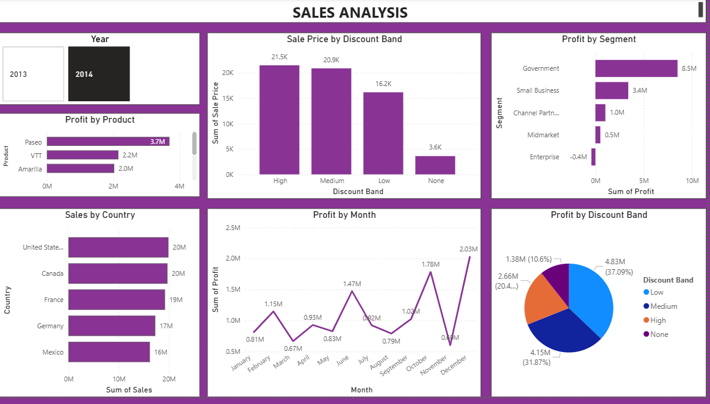

# sales_analysis_power_BI

# Power BI Sales and Profit Analysis Dashboard

## 📊 Overview
This Power BI report provides a comprehensive analysis of product performance, profitability, and sales trends across regions, segments, and discount bands. The insights are designed to support data-driven decisions in sales strategy, pricing, and market focus.

---
## Problem Statement
Analyze product performance, profitability, and sales trends to identify key business drivers and support data-driven sales strategy decisions.

## Approach
- Analyzed sales data across multiple dimensions: products, regions, customer segments, and discount levels
- Tracked profit trends over time (monthly tracking)
- Examined distribution patterns across discount bands and countries

## Tools Used
- Microsoft Power BI Desktop – for data visualization and dashboard creation
- Company sales database – containing sales, profit, and discount records
  
## Key Lessons / Findings
1. Top Product: Paseo leads with $4.8M profit—products are strong profit drivers
2. Segment Success: Government and Small Business segments are most profitable
3. Discount Insight: Medium and high discounts drive sales volume without reducing profits
4. Geographic Strength: U.S. and Canada dominate revenue
5. Growth Trend: Consistent monthly profit growth shows improving sales execution
6. Profit Distribution: Profits are well-balanced across all discount levels

## 🏆 Top Insights

### **1. Top Performing Product**
- **Paseo** generated the highest profit of **$4.8M**, followed by **VTT** and **Amarilla**.
- These products are key drivers of overall profitability.
- 
### **2. Profit by Segment**
- The **Government** and **Small Business** segments contributed the largest share of total profit.
- This indicates strong performance among **institutional and SME clients**.

### **3. Sales by Discount Band**
- **Medium** and **High** discount bands recorded the highest sales volume.
- Suggests that **discount incentives are positively influencing sales growth**.

### **4. Sales by Country**
- **United States** and **Canada** are the top-performing countries in terms of sales revenue.
- Highlights a strong **market presence in North America**.

### **5. Profit Trend**
- The **Profit by Month** chart shows a **steady upward trend** with noticeable peaks in later months.
- Implies **improved sales execution and revenue growth** over time.

### **6. Profit Distribution**
- The **Profit by Discount Band (Pie Chart)** shows profits are **well-distributed across discount levels**.
- Indicates that **higher discounts do not necessarily reduce profitability**.

---

## 💡 Key Recommendations

1. **Regional Focus:**  
   Concentrate marketing and distribution efforts in **high-performing regions** (U.S. & Canada).
2. **Discount Strategy:**  
   Maintain **competitive discount policies** that balance **profitability and sales volume**.
3. **Segment Engagement:**  
   Strengthen **relationships with government and SME clients** to sustain top-segment performance.
4. **Performance Monitoring:**  
   Track **monthly profit trends** to improve **forecasting and resource allocation**.

---

## 📁 File Information
- **File Name:** `Sales_Analysis.pbix`  
- **Tool:** Microsoft Power BI Desktop  
- **Data Sources:** Company sales, profit, and discount records  
- **Last Updated:** October 2025  

---

## 🚀 How to Use
1. Download the `.pbix` file from this repository.  
2. Open it in **Power BI Desktop (latest version)**.  
3. Refresh data sources if connected to a live database (optional).  
4. Explore visualizations, filters, and insights interactively.

---

## 📈 Dashboard Preview

---

**Author:** Salome Kungu

